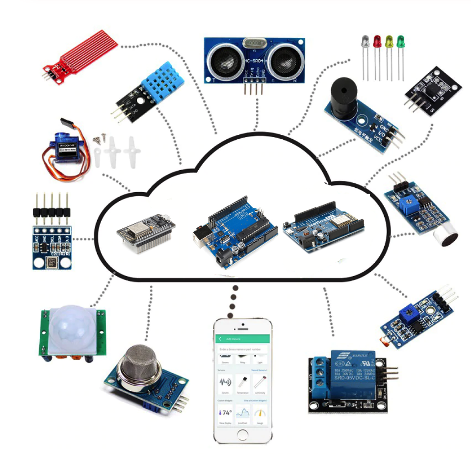

<td style="width: 20%;"></td>

## Laboratório de IoT do Curso de Eletrotécnica

<strong>Internet das Coisas - Kit de desenvolvimento em Arduino, Wemos D1 e NodeMCU</strong>

<strong>Prof Epaminondas Lage</strong>

<a href="http://lattes.cnpq.br/7787341723868111"> Currículo Lattes LAGE, E. S.</a> 

## Introdução
A evolução tecnológica surpreende e até mesmo nos assusta, seja por sua sua velocidade ou pelas mudanças repentinas. Acompanhamos a miniaturização da tecnologia e o aumento assintótico da capacidade de processamento e armazenamento de dados dos computadores. Como consequência, áreas como automação, instrumentação industrial e telecomunicações têm espaço garantidos nesta corrida e cada vez mais podemos observar diferentes grandezas físicas e oferecer acesso simultâneo a estas informações para diferentes públicos. 

Em uma indústria 4.0, podemos monitorar grandezas como campo eletromagnético, corrente elétrica, vazão, pressões, grandezas quimicas, temperatura entre outras e os sistema supervisórios indicando o melhor momento de realizar uma atuação. No setor automobilistico e de transporte, veículos completamente autônomos, carros com inúmeros sensores, o controle on-line de movimentação de carga. No setor médico, sensores podem permitir a avaliação de dados de pacientes de forma remota e preventiva, integrado com roupas e dispositivos de uso pessoal. Ou seja, todas as “coisas” podem ser monitoradas ou fornecer dados instantaneamente onde quer que estejam. 

Neste contexto apresentamos a era da “Internet das Coisas”. Ela proporciona o acesso a dados por meio de redes interconectadas com a internet, seja fins de automação ou para a otimização do dia-a-dia das pessoas. Este KIT apresenta informações introdutórias de como fazer com que este mundo seja apresentado aos nossos alunos, utilizando das tecnologias embarcadas mais difundidas, a plataforma de microprcessadores Arduino. O nosso objetivo é despertar o interesse do aluno do Curso de Eletrotécnica do CEFET-MG para as mais diferentes aplicações baseadas nos conceitos da Internet das Coisas.

Neste repositório o aluno encontrará uma descrição completa do KIT de sensores do Laboratório de IoT do Curso de Eletrotécnica do CEFET-MG. Fundamente-se no aprendizado básico do microcontrolador Arduino com  sensores. Reunimos 37 sensores e módulos básicos, visando o aprendizado conveniente para iniciantes. Neste kit, existem sensores/atuadores digitais e analógicos e também alguns módulos especiais, como ultrassom, Bluetooth, módulo de aceleração, WIFI, entre outros.

Para cada módulo, há um diagrama de conexão e um código de exemplo. Portanto, mesmo se você seja totalmente novo, pode começar facilmente. Os códigos de exemplo para este kit de sensores são baseados no ARDUINO, porque é de código aberto e fácil de usar. Se você tiver conhecimentos prévios, também pode aplicar este kit a outras plataformas de desenvolvimento de MCU, Raspberries Pi, etc. O princípio de funcionamento é praticamente o mesmo.

Agora, vamos abraçar este mundo fascinante do ARDUINO e aprender juntos!
## Microcontroladores disponibilizados no Kit
## Arduino UNO
https://github.com/arduino/Arduino
<table>
<tbody>
<tr>
<td style="width: 30%;"></td>
<td style="width: 70%;">

Arduino é uma plataforma de prototipagem eletrônica de hardware livre e de placa única, projetada com um microcontrolador Atmel AVR com suporte de entrada/saída embutido, uma linguagem de programação padrão, a qual tem origem em Wiring, e é essencialmente C/C++. O objetivo do projeto é criar ferramentas que são acessíveis, com baixo custo, flexíveis e fáceis de se usar por principiantes e profissionais. Principalmente para aqueles que não teriam alcance aos controladores mais sofisticados e ferramentas mais complicadas.

</td>
</tr>
</tbody>
</table>

## Wemos D1
https://github.com/wemos
<table>
<tbody>
<tr>
<td style="width: 30%;"></td>
<td style="width: 70%;">

É uma plataforma de prototipagem que possui as mesmas dimensões do Arduino Uno R3. As diferenças mais básicas em relação ao Arduino são o conector micro USB e um ESP8266-12E. A Wemos D1 já conta com WiFi nativo, o que a torna uma plataforma extremamente atraente para desenvolvimento de projetos Iot.

</td>
</tr>
</tbody>
</table>

## ESP32 DEVKIT V1
https://github.com/espressif/arduino-esp32
<table>
<tbody>
<tr>
<td style="width: 30%;"></td>
<td style="width: 70%;">

<h2 id="Caracteristicas do Chip ESP32">Caracter&iacute;sticas do Chip ESP32</h2>

Esse <strong>ESP32</strong> &eacute; um super chip !&nbsp; Ele possui dois Microprocessadores&nbsp; Xtensa&reg; 32-bit LX6&nbsp; com at&eacute; 600 DMIPS (velocidade de processamento). A frequ&ecirc;ncia do clock pode ser de at&eacute; 240 MHz, dependendo do modelo. A frequ&ecirc;ncia mais comum &eacute; 160 MHz ( 10 vezes o clock do Arduino Uno).

<ul>
<li>mem&oacute;ria ROM&nbsp; interna de 448K Bytes (para Boot e Core)</li>
<li>mem&oacute;ria RAM est&aacute;tica interna de 520K Bytes</li>
<li>Mem&oacute;ria externa (total 4) &ndash; suporte para at&eacute; 16M Bytes Flash e 16M Bytes SRAM</li>
<li>1 K Bit de Fus&iacute;veis eletr&ocirc;nicos (para seguran&ccedil;a e criptografia)</li>
<li>Real Time Clock com 16K Bytes de SRAM</li>
<li>Interface WIFI&nbsp;802.11 b/g/n &ndash; 802.11 n (2.4 GHz), at&eacute; 150 Mbps</li>
<li>Interface Bluetooth&nbsp;v4.2 BR/EDR e&nbsp; Bluetooth LE (low energy)</li>
<li>Dois grupos de Timers &ndash; 4 timers de 64 Bits</li>
<li>Aceleradores de hardware&nbsp;(criptografia) &ndash; AES, SHA, RSA e ECC</li>
<li>Alimenta&ccedil;&atilde;o VCC de 2,3V a 3,6V CC</li>
<li>Consumo de corrente max com WIFI &ndash; 240 mA</li>
</ul>

<strong>Perif&eacute;ricos do Chip ESP32&nbsp;</strong>

<ul>
<li>34 &times; Portas program&aacute;veis GPIOs</li>
<li>2 x Conversores ADC SAR 12-bits com at&eacute; 18 canais</li>
<li>2 &times; Conversores DAC de 8-bits</li>
<li>10 &times;&nbsp; sensores de toque</li>
<li>Sensor de Temperatura</li>
<li>4 &times; interfaces SPI &ndash; clock at&eacute; 40 MHz !</li>
<li>2 &times; interfaces I2S &ndash; clock at&eacute; 40 MHz !</li>
<li>2 &times; interfaces I2C&nbsp;&ndash; at&eacute; 5 Mbps</li>
<li>3 &times; interfaces seriais UART &ndash; at&eacute; 5 Mbps !</li>
<li>1 Host (SD/eMMC/SDIO) para controle de SD Cards</li>
<li>1 Escravo (SDIO/SPI)</li>
<li>Interface Ethernet MAC (necessita acess&oacute;rio)</li>
<li>Interface CAN 2.0</li>
<li>Interface Infra-vermelho&nbsp; (Tx/Rx)</li>
<li>Controle de Motor PWM</li>
<li>Controle de LED PWM at&eacute; 16 canais</li>
<li>Sensor interno Hall</li>
</ul></td>
</tr>
</tbody>
</table>

## Kit - Parte física
<table style="width: 566px;">
<tbody>
<tr>
<td style="width: 173px;">img src="img/kit_1.jpeg"</td>
<td style="width: 160px;">img src="img/kit1.png"</td>
<td style="width: 211px;">img src="img/kit2.png"</td>
</tr>
</tbody>
</table>
<table>
<tbody>
<tr>
<td>A caixa do KIT foi projetada e constru&iacute;da usando a tecnologia de impress&atilde;o 3D. J&aacute; utilizada em diversos segmentos, em especial, para pequenas produ&ccedil;&otilde;es. Todas as pe&ccedil;as pl&aacute;sticas foram feitas em impressoras tridimensionais com o objetivo de facilitar a montagem dos sensores aos microcontroladores e fonte de alimenta&ccedil;&atilde;o.</td>
</tr>
</tbody>
</table>

  

## Sensores/atuadores/módulos
<td style="width: 30%;"></td>

Reunimos sensores, atuadores, displays, LEDs, resistores e módulos básicos, visando o aprendizado conveniente para iniciantes. Dentro desta caixa, existem diversos módulos de sensores digitais e analógicos, atuadores e também alguns módulos especiais, como ultrassom, Bluetooth, WIFI, módulo de aceleração, displays de LED e LCD, etc.

Para cada módulo, há um diagrama de conexão e um código de exemplo. Portanto, mesmo se você for um iniciante, você pode começar facilmente. Os códigos de exemplo para este kit de sensores são baseados no ARDUINO e são fáceis de usar. Pode aplicar este kit a outras plataformas de desenvolvimento de MCU e WEMOS D1 os quais compões este kit. O princípio de funcionamento é praticamente o mesmo.

Agora, vamos abraçar este mundo fascinante de ARDUINO e IoT e aprender juntos!

## Sensores/atuadores/módulos que compõem o kit
* <a href="sensores/Botao">Botão</a> 
* <a href="sensores/Buzzer">Buzzer</a>        		
* <a href="sensores/Chave_de_mercurio">Chave de mercúrio</a>          	
* <a href="sensores/Emissor_de_infravermelho">Emissor de infravermelho</a>          	
* <a href="sensores/Emissor_de_laser"> Emissor de laser</a>          	
* <a href="sensores/Fotoresistor">Fotoresistor</a>         	
* <a href="sensores/Interruptor_de_inclinacao_do_mercurio"> Interruptor de inclinação do mercúrio</a>          	
* <a href="sensores/Interruptor_reed"> Interruptor reed</a>         	
* <a href="sensores/JoyStick"> JoyStick</a>         	
* <a href="sensores/LED_Flash_de_7_Colores"> LED Flash de 7 cores</a>         	
* <a href="sensores/LED_de_duas_cores"> LED de duas cores</a>       	
* <a href="sensores/Mini_interruptor_reed"> Mini interruptor reed</a>          	
* <a href="sensores/RGB_Led"> LED RGB</a>     	
* <a href="sensores/Receptor_de_infravermelho"> Receptor de infravermelho</a>         	
* <a href="sensores/Rele"> Relé</a>          	
* <a href="sensores/Rotary_Encoder"> Encoder rotativo</a>          		
* <a href="sensores/SMD_RGB_LED"> LED RGB SMD</a>       	
* <a href="sensores/Sensor_Hall_Linear"> Sensor Hall Linear</a>          		
* <a href="sensores/Sensor_Hall_Magnetico"> Sensor Hall Magnético</a>         	
* <a href="sensores/Sensor_Hall_analogico"> Sensor Hall analógico</a>         	
* <a href="sensores/Sensor_de_batimentos_cardiacos"> Sensor de batimentos cardíacos</a>          	
* <a href="sensores/Sensor_de_bloqueio_de_luz"> Sensor de bloqueio de luz</a>         		
* <a href="sensores/Sensor_de_chamas"> Sensor de chamas</a>      	
* <a href="sensores/Sensor_de_vibracao"> Sensor de vibração</a>     	
* <a href="sensores/Sensor_de_obstaculo"> Sensor de obstáculo</a>
* <a href="sensores/Sensor_de_rastreamento"> Sensor de rastreamento</a>         		
* <a href="sensores/Sensor_de_temperatura"> Sensor de temperatura</a>        	
* <a href="sensores/Sensor_de_temperatura_analogico"> Sensor de temperatura analógico</a>          		
* <a href="sensores/Sensor_de_temperatura_digital "> Sensor de temperatura digital</a>       	
* <a href="sensores/Sensor_de_temperatura_e_humidade"> Sensor de temperatura e humidade</a>         		
* <a href="sensores/Sensor_de_toque"> Sensor de toque</a>
* <a href="sensores/Sensor_grande_de_som"> Sensor de som alto</a>        		
* <a href="sensores/Sensor_pequeno_de_som"> Sensor de som baixo</a>         		
* <a href="sensores/Tilt_Switch"> Tilt Switch</a>

## Topologia de Rede do Laboratório

O laboratório de IoT está localizado na sala 702 do prédio 19 do Campus2 do CEFET-MG. É utilizado em conjunto com outras disciplinas e possue 10 microcomputadores ligados em uma rede local isolada por um firewall da rede institucional do CEFETMG conforme topologia abaixo:
<td style="width: 30%;"></td>

## Informaçoes Gerais de Operação

- 01 servidor de rede 
- 01 roteador de WIFI
- 10 KITs de trabalho e seus respectivos módulos/sensores.
- 10 Estações de Trabalho - Windows 7
- IP's Fixos faixa 10.0.0.10 a 10.0.0.18. através de placa WIFI.
- IDE Arduino com drives atualizados .
- IDE com suporte às placas Arduino UNO, ESP 8266, Wemos D1, NodeMCU V2
- Drives de comunicação serial/USB atualizados para os processoadores em uso.
- Acesso ao repositório de arquivos no servidor 10.0.0.1.
- Os dispositivos somente conectam à rede WIFI apenas com SSID e senha.
- Esta rede não tem conexão com a Internet salvo momentos de atualização da IDE/libs e será feita através de liberação no firewall.
- A rede tem ip fixo nas estações de trabalho e DHCP para os demais dispositivos.
- O servidor de rede é um edgecomputer com Linux e serve como broker de MQTT, servidor de arquivos, Firewall, DHCP Server, PROXY Server, etc.
 
## Material Didático

Neste <a href="/material_didatico"> repositório</a>  está disponibilizado ppt, apostilas, manuais, etc.

## Trabalhos publicados na área com participação do autor 

* <a href="https://ieeexplore.ieee.org/document/8263304"> Improving the consumption and water heating efficiency in smart buildings</a>         		
* <a href="https://ieeexplore.ieee.org/abstract/document/8767325"> Low-Cost IoT Surveillance System Using Hardware-Acceleration and Convolutional Neural Networks</a>

## Status

Este repositório é para alunos do Curso de Eletrotécnica do CEFET-MG

## Contato

Criado/adaptado por Epaminondas de Souza Lage - epaminondaslage@gmail.com ou epaminondaslage@cefetmg.br
