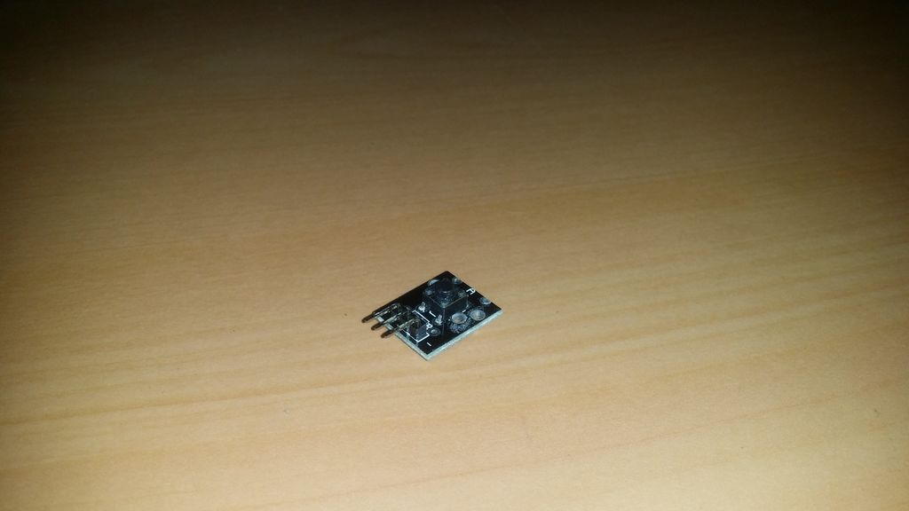

## Botão

É um módulo pronto para uso em projetos eletrônicos que necessitem de um simples dispositivo de entrada digital, e pode ser usado nos mais variados circuitos eletrônicos e placas como por exemplo Arduino.
