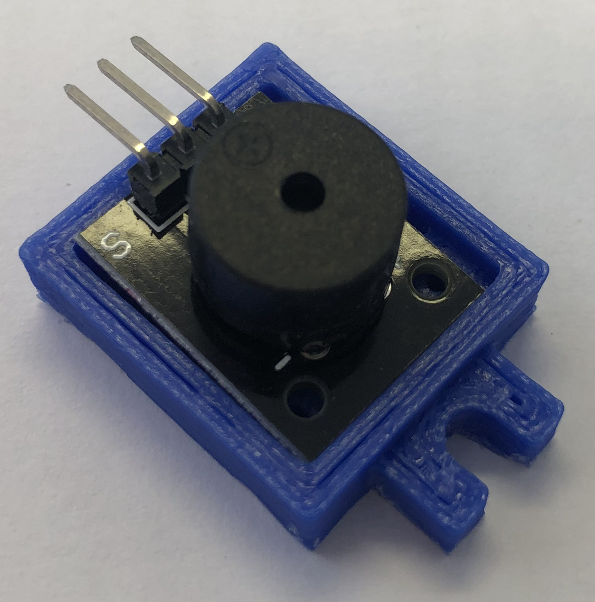

## Buzzer

Este módulo Buzzer 5V passivo é um componente muito usado em projetos com microcontroladores como o Arduino. Pode até programar músicas completas no seu Arduino e fazer com que a campainha as toque!
