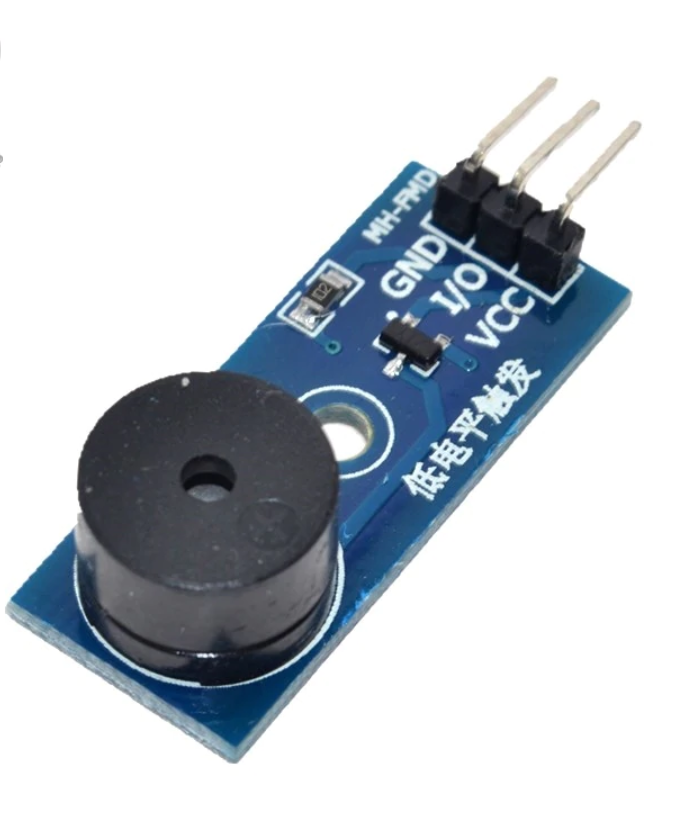

## Buzzer

## Características

- tensão de trabalho de3.3 V para 5 V
- furo passante fixo, a instalação conveniente
- tamanho da placa PCB: 3.3 centímetros X 1.3 cm
- interface do módulo (3 sistema de fios)

# Pinagem

- VCC 3.3 V externo para 5 1 V tensão (que pode ser conectado diretamente ao 5 V microcontrolador e 3.3 V microcontrolador)
- GND GND externo
- I/O microcontrolador externo porta I/O
