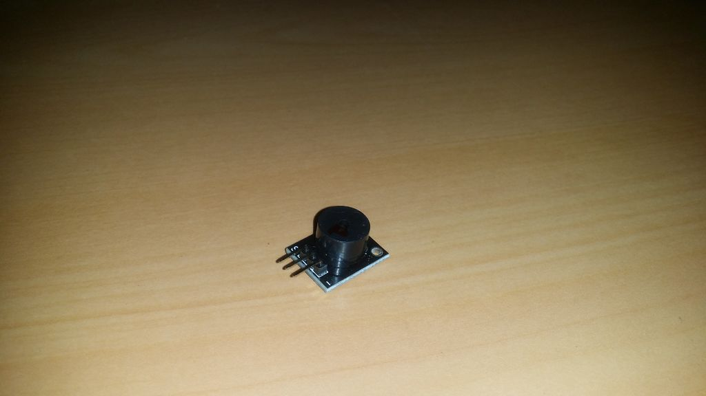

## Buzzer Passivo

Essa campainha é igual à declarada na etapa anterior. A única diferença é que este possui um melhor controle de frequência.

Ele também precisa de um código diferente para funcionar.