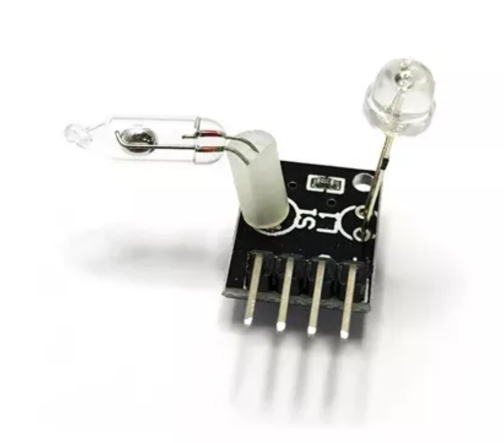

## Chave de Mercúrio

Chave Mercúrio com Led Vermelho
Os módulos de chave de mercúrio contêm interruptores que fornecem um sinal digital. Este módulo é composto por um LED vermelho e um interruptor de inclinação de mercúrio inclusos na mesma placa. Caso o projeto necessite de um led e uma chave de inclinação este módulo é ideal.
