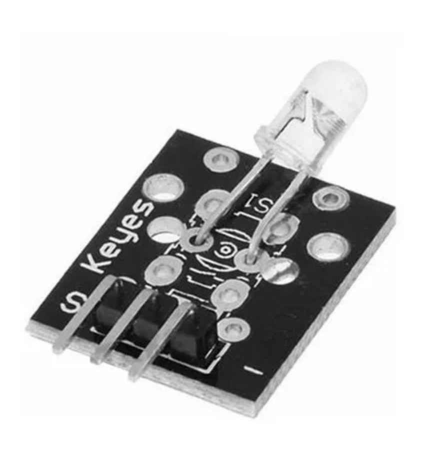

## Emissor Infravermelho

Módulo transmissor infravermelho para Arduino, emite a luz infravermelha em 38kHz. O módulo do transmissor infravermelho consiste apenas em um diodo emissor de luz de 5mm. Ele funciona em conjunto com o módulo receptor KY-022. Compatível com plataformas eletrônicas populares como Arduino e Raspberry Pi.
Este LED que emite uma luz infravermelha que pode ser usada para, por exemplo, controlar sua TV ou como fonte de luz para uma câmera de segurança infravermelha.
