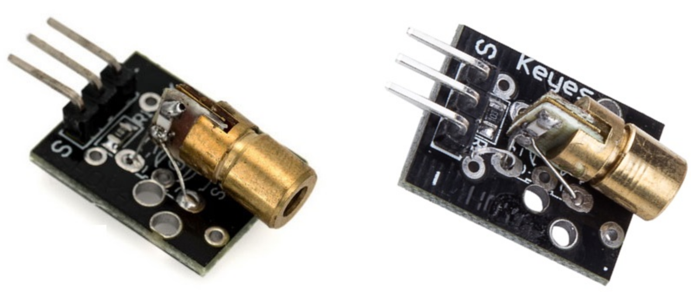

## Emissor de Laser

Este módulo laser funciona com tensão de 5V e pode ser facilmente conectado a um Arduino ou outro microcontrolador. Utilizado em vários projetos como detecção de movimento e segurança.

Possui três pinos, sinal (S), VIn (central) e GND (terra). A placa possui furos para facilitar a instalação.
 
Especificação

    Cor: vermelha
    Comprimento de onda: 650 nm
    Tensão de operação: 5V
    Potência: 5 mW
