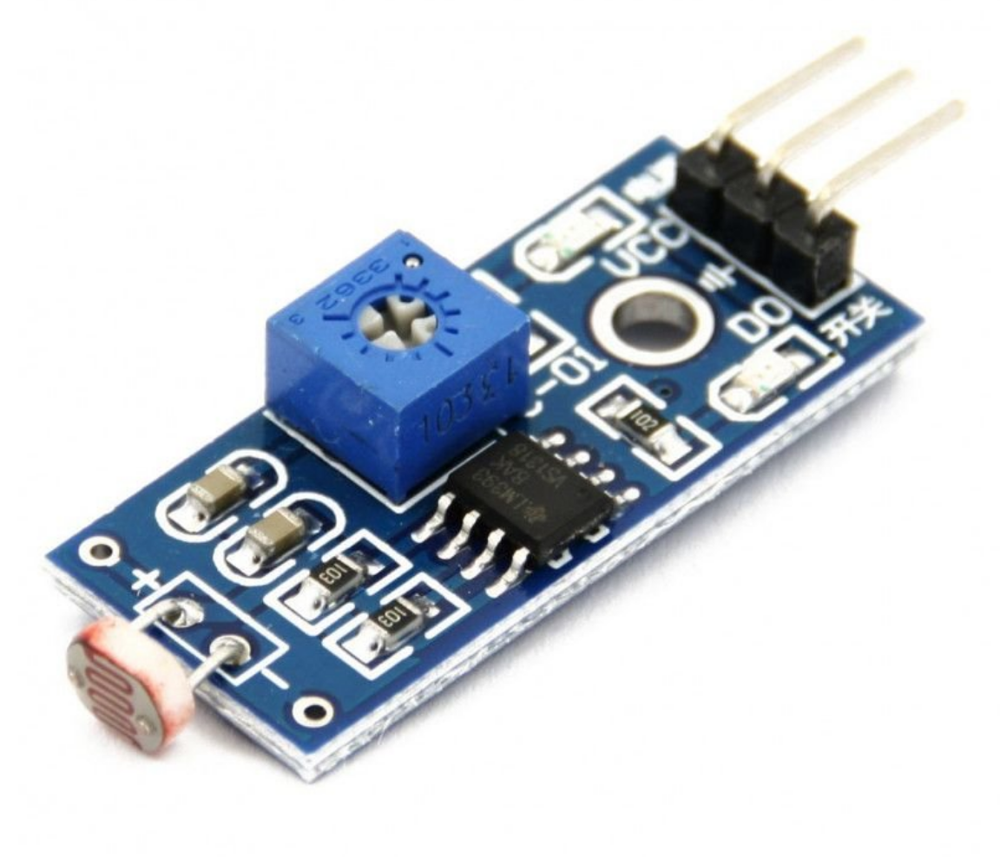

## Fotoresistor

Este é um resistor variável. O valor da resistência depende da quantidade de luz que entra no LDR (Light Dependend Resistor).Este módulo sensor de luz é baseado em um foto resistor que mede a intensidade da luz ambiente através da variação de sua resistência interna. Este módulo sensor de luz pode ser utilizado para detectar a intensidade de luz no ambiente.

# Especificações:

- Comparador LM393
- Tensão de Operação: 3.3-5V DC
- Sensibilidade ajustável via potenciômetro
- Saída Digital
- Fácil instalação
- Led indicador para saída digital

# Pinagem:

- GND: Terra
- VCC: Tensão de Entrada 3.3-5V
- D0: Saída Digital
