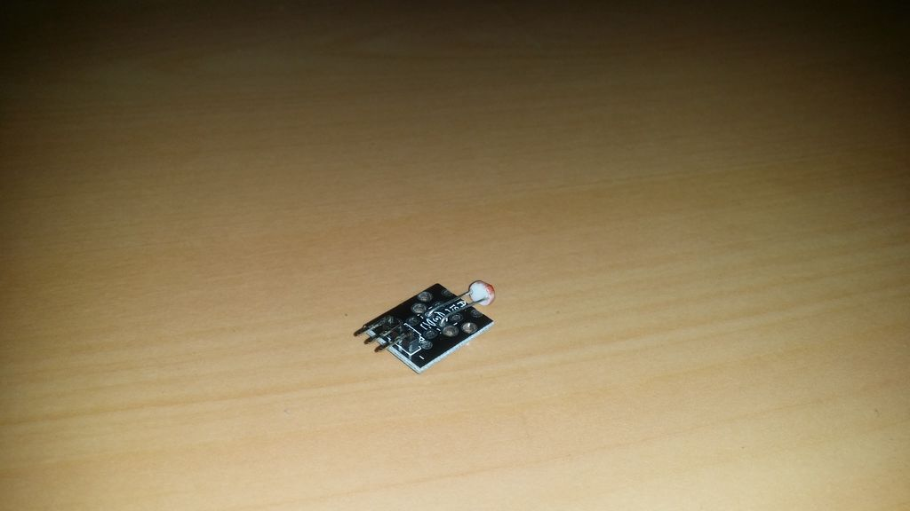

## Fotoresistor

Este é um resistor variável. O valor da resistência depende da quantidade de luz que entra no LDR (Light Dependend Resistor).

Isso pode ser usado para acender uma luz quando escurecer.