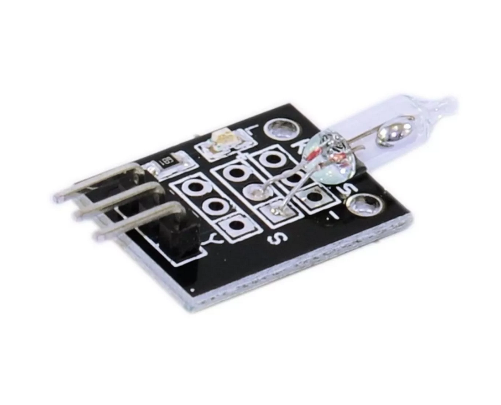

## Interruptor de inclinação do mercurio

O Módulo Sensor de Inclinação Interruptor de Mercúrio é ideal para utilização em inúmeros projetos. Seu funcionamento é bem simples, dentro do bulbo está presente uma gota de mercúrio e terminais, onde, dependendo da posição em que o sensor se encontra, a gota de mercúrio encostará no contato abrindo ou fechando o contato, funcionando como um sensor de inclinação.

Módulo Sensor de Inclinação Interruptor de Mercúrio - Especificações:

- Tensão de operação: 3.3V - 5V;
- Dimensões: 30x20x8mm.
