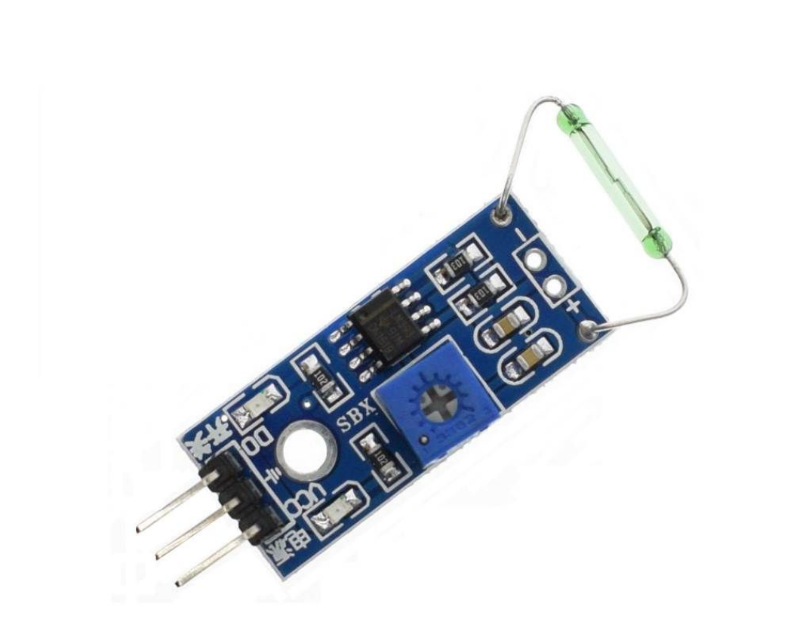

## Interruptor REED

Um interruptor de palheta é um interruptor que precisa de um imã na frente para ligar ou desligar.Este Módulo possui uma chave Reed Switch, que é um componente passivo acionado por campo magnético. Possui contatos elétricos NA, e consiste-se em uma ampola de vidro com dois terminais.

# Especificações:

- Alimentação: 5V DC
- Dimensões: 35 x 15mm
