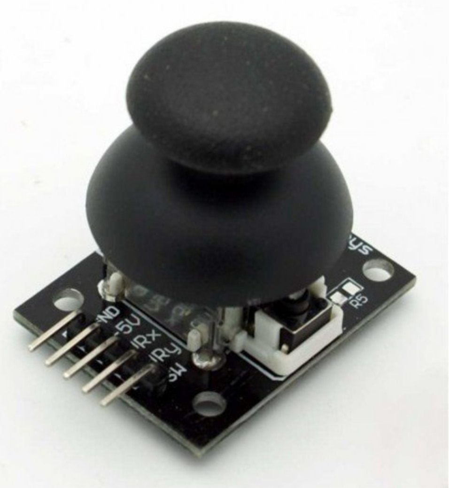

## JoyStick

O JoyStick é um sensor analógico que pode ser usado para controlar o seu arduino.Os JoySticks analógicos são basicamente potenciômetros, portanto, eles retornam valores que podem ser tornados visíveis usando o código fornecido nesta etapa.
Ao clicar no monitor serial, você verá os valores. Depois de mover o JoyStick, os valores serão alterados. Esse código também é útil se você deseja controlar o seu Arduino usando um JoyStick.

O Joystick tem seu princípio de funcionamento através do controle de 2 potenciômetros e um botão. Duas das entradas dos potenciômetros referem-se aos eixos X e Y, sendo que o botão quando pressionado refere-se ao eixo Z. Logo este Joystick contém o total de três interfaces de entradas que são utilizadas para conectar ao eixo X, Y e Z. Este modelo com menos pinos torna-se uma ótima opção para projetos com Arduino pois evita muitas conexões, podendo ser usado como mouse, controle de robôs, games, joystick ps2 e projetos em geral.

Características:

- +5V ou VCC: 3,3-5V
- GND: GND
- X ou VRx: Saída Analógica Eixo X
- Y ou VRy: Saída Analógica Eixo Y
- SW ou Key: Saída Digital Eixo Z
