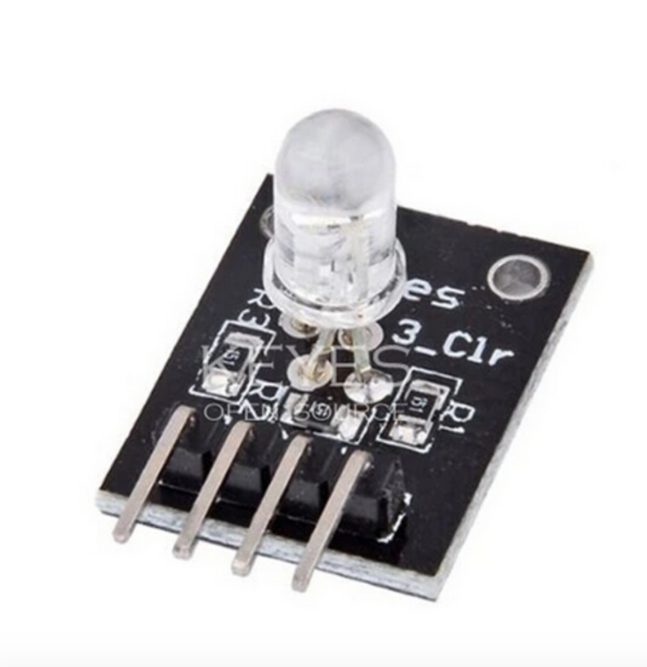

## Led de 7 cores

Módulo de LED GB O LED é feito de um plug-in colorido, pela tensão de entrada PWM de três pinos R, G, B pode ser ajustada em três cores principais (vermelho / azul / verde), a fim de obter o efeito de mistura de cores . O módulo de controle com efeitos de iluminação legal do Arduino pode ser alcançado. Este LED alterna automaticamente entre 7 cores. O LED possui um IC integrado. Se você desconectar o LED, as cores serão redefinidas e a animação será reiniciada.
 
# Parâmetros do módulo:

- Use o LED colorido plug-in
- Resistor limitador tricolor RGB para evitar queima
- Três cores primárias podem ser misturadas para obter cores diferentes, ajustando o PWM
- Pode interagir com uma variedade de microcontroladores
- Tensão de operação: 5V
- Modo de acionamento por LED:  catódo comum

