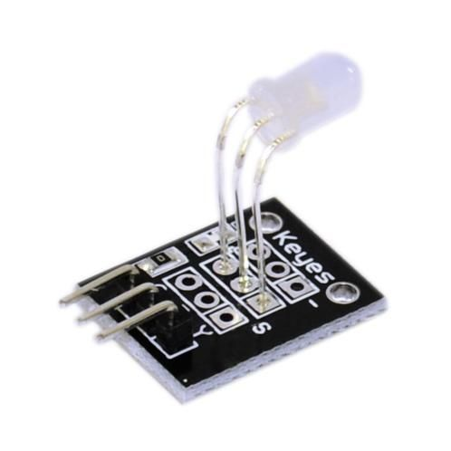

## LED de duas cores

Este LED contém dois diodos emissores de luz. Um pino é o GND e os outros dois são para um LED vermelho e verde.

Ao ligar o GND e um dos pinos, você pode ver uma das cores. Você também pode ligar o GND e os dois pinos ao mesmo tempo para misturar a cor e obter uma cor amarela / laranja.