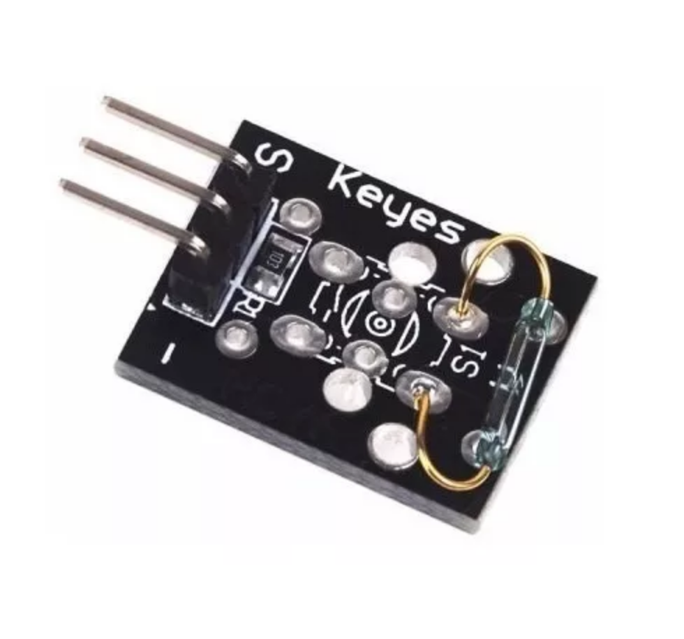

## Mini Interruptor Reed

O sensor mini reed é ideal para a adição de um interruptor magnético no seu projeto. O sensor é acionado quando próximo de campos magnéticos produzidos por ímãs ou eletro-ímãs. É um módulo simples que vai se adequar e pode ser usado dentro de uma ampla gama de projetos baseados em microcontroladores como placas Arduino. O módulo tem um furo de montagem M3 permitindo a sua fixação fácil a uma infinidade de superfícies.
