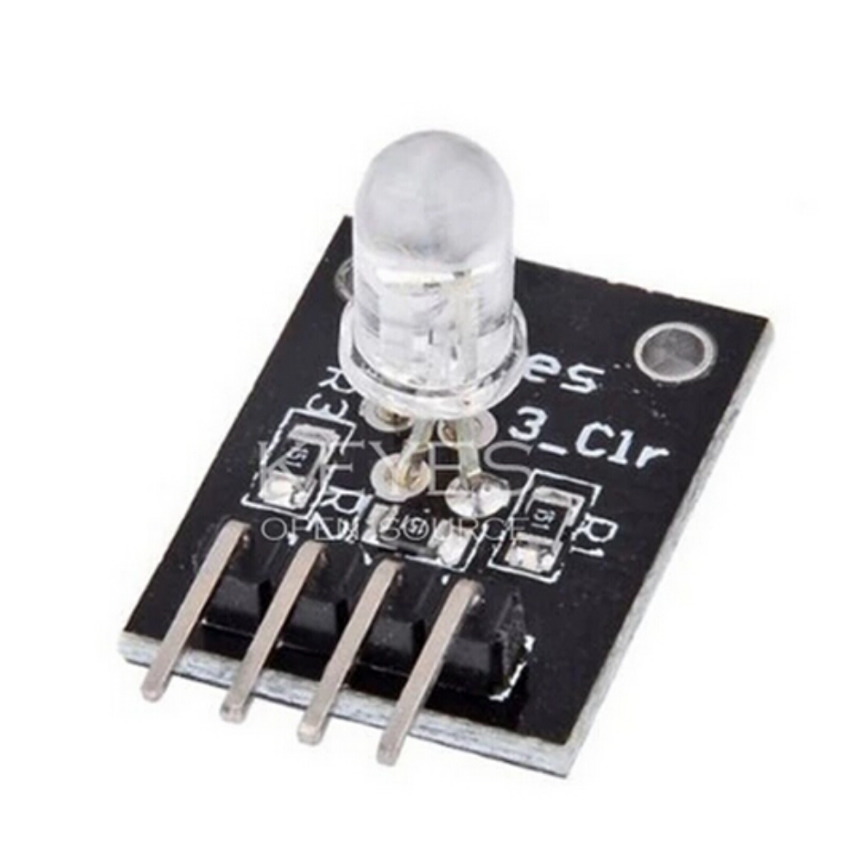

## LED RGB

O LED RGB tem a capacidade de exibir uma grande quantidade de cores que são originadas a partir de três cores primárias. Este tipo de LED possui três LEDs encapsulados em um mesmo dispositivo, onde cada LED representa uma cor distinta: vermelho (Red), verde (Green) e azul (Blue).  Cada um destes LEDs pode ser controlado de forma individual e se combinados podem gerar diversas cores.

– Especificações e características:

– Tensão de operação (vermelho): 2 a 2,5VDC
– Tensão de operação (verde): 3,2 a 3,6VDC
– Tensão de operação (azul): 3,2 a 3,6VDC
– Corrente de operação (em cada LED): 20mA
– Configuração: catodo comum
– Comprimento de onda (vermelho): 620nm
– Comprimento de onda (verde): 520nm
– Comprimento de onda (azul): 470nm
– Temperatura de operação: -40º a 85º celsius
– Ângulo de abertura: 30º
