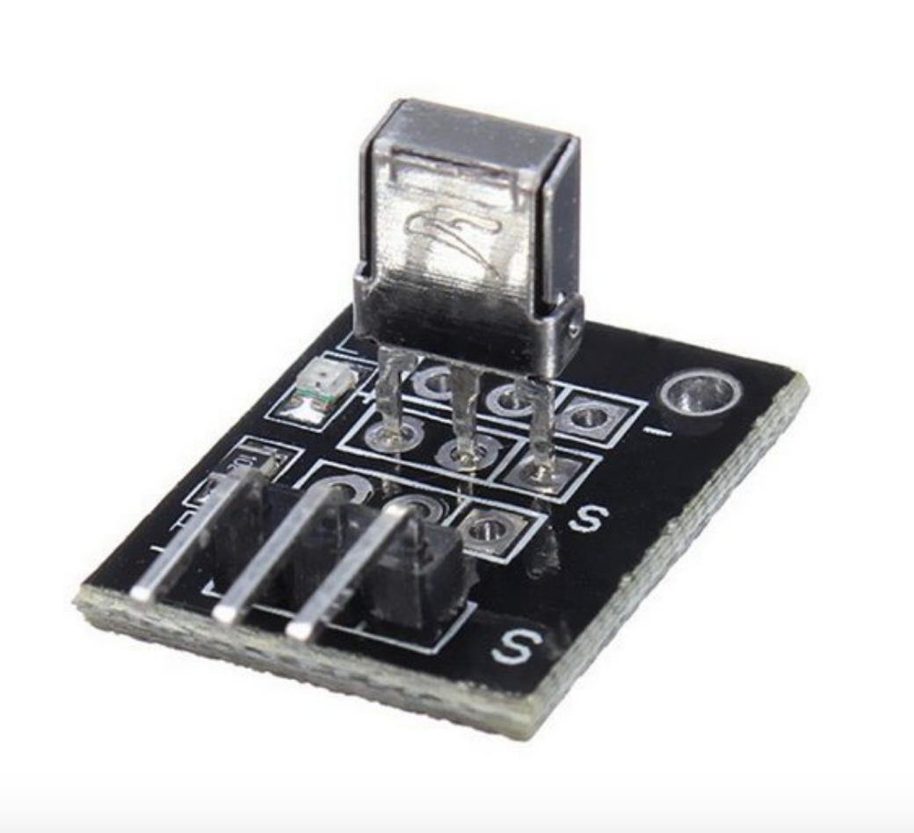

## Receptor de infravermelho

- O Receptor Infravermelho 1338B é um componente eletrônico projetado para receptar sinais infravermelhos enviados por dispositivos remotos, os quais contenham comandos específicos enviados a uma placa microcontroladores.
- Compatível com a maioria dos sistemas microcontroladores, entre eles, Arduino, o Receptor Infravermelho 1338B é de fácil instalação, já que conta 3 pinos para ligação com a placa do microcontrolador.
- Um exemplo prático a ser destacado de sua utilização é na aplicação em que um controle remoto envia sinais infravermelhos codificados para a placa do microcontrolador, que os recepta através do Receptor Infravermelho 1338B, processando os dados recebidos e enviando os comandos a outros dispositivos eletrônicos.
 

CARACTERÍSTICAS:
- Receptor infravermelho 1838B;
- Componente eletrônico;
- Distância de Alcance: Até 18 metros (sem obstáculos);
- Compatível com Arduino, Raspberry Pi, AVR, PIC, ARM e etc;
- 3 pinos para aplicação;
- Compatível com a maioria dos controles remotos;
- Pinagem pode ser vista no datasheet;

ESPECIFICAÇÕES:
- Modelo: VS 1838B;
- Tensão de trabalho: 2,7V ~ 5,5V;
- Consumo de corrente: 1,5uA;
- Frequência de trabalho: 38Khz;
- Ângulo: +/- 45°;
- Tensão em nível lógico baixo: 0,4V;
- Tensão em nível lógico alto: até 4,5V;
- Temperatura de trabalho: -20° ~ 85°;
- Dimensões (CxLxE):7,5x6x5,2mm; (ignorando-se os pinos)
- Comprimento total: 29,8mm;
- Peso: 1g. 
