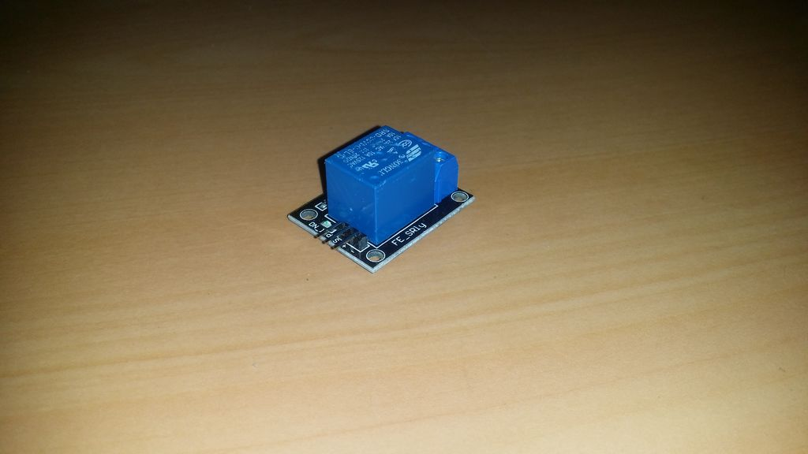

## Relé

Um relé é usado para alternar aplicações de alta tensão usando uma tensão mais baixa. Isso também é frequentemente usado em residências, pois é uma opção segura para ligar e desligar altas tensões.

Você aplica uma pequena tensão (5V) a um lado do relé e ele liga ou desliga o outro lado.
