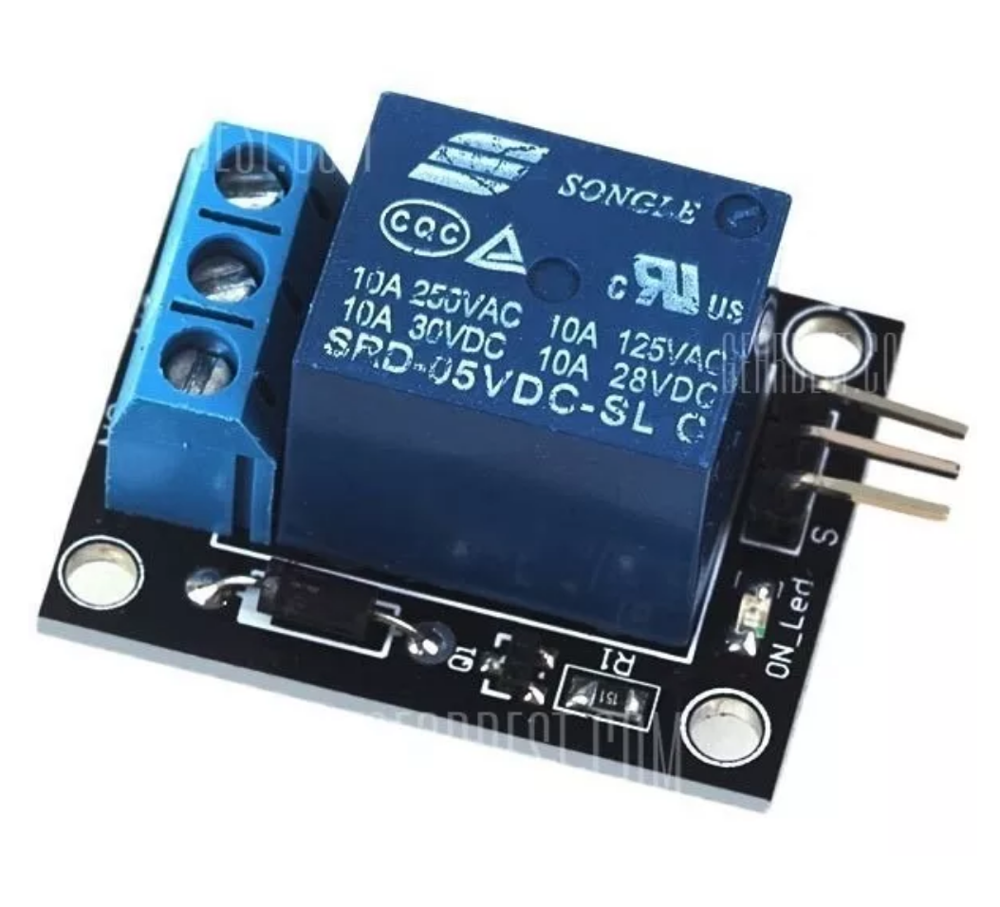

## Relé

Com o Módulo Relé 5V 1 Canal você pode controlar lâmpadas, motores, eletrodomésticos e outros equipamentos utilizando apenas um pino de controle, já que o circuito a ser alimentado fica completamente isolado do circuito do microcontrolador. De fácil utilização com Arduino. O módulo relé 1 canal funciona com tensão de 5V, e pode acionar cargas de até 250 VAC ou 30 VDC, suportando uma corrente máxima de 10A. Possui led indicador de energia, 2 pinos de energia e 1 de controle, além do borne de saída com parafusos, facilitando a conexão dos equipamentos.

Parâmetros
- Módulo Relé 1 Canal
- Tensão de operação: 5V
- Tensão máxima de carga: 240VAC
- Corrente máxima de carga: 10A
- Dimensões 34 x 27 x 17mm
