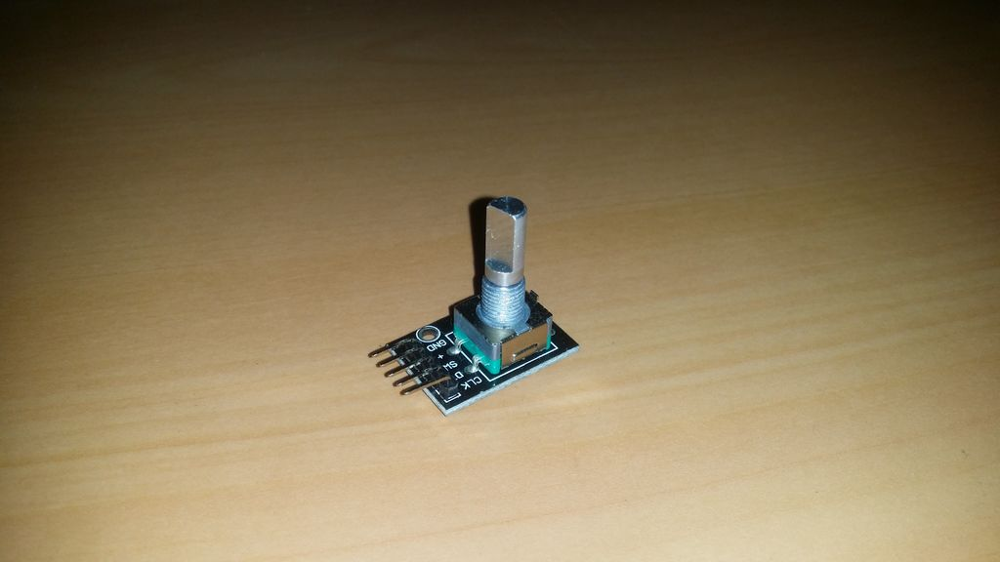

## Rotary Encoder

Ao girar, o codificador rotativo pode ser contado na direção positiva e na direção reversa durante a rotação da frequência de pulso de saída, diferentemente do contador do potenciômetro rotativo, cuja contagem de rotação de espécies não é limitada. Com os botões no codificador rotativo pode ser redefinido para seu estado inicial, que começa a contar a partir de 0.