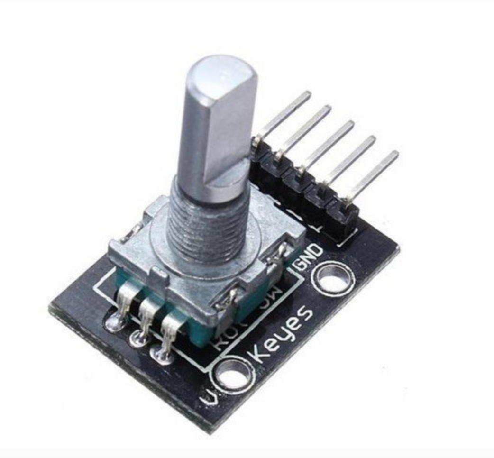

## Rotary Encoder

Mais especificamente este é um encoder rotatório comumente usado para medir movimento rotacional de um eixo, pois converte movimentos rotativos em impulsos elétricos de onda quadrada, gerando assim uma quantidade exata de impulsos por volta, que neste caso são 20 pulsos por resolução. Com estes impulsos você pode facilmente calcular o deslocamento, além é claro de determinar posição e direção pelo código gray. Este encoder também possui um botão extra, basta pressionar o eixo.

 

Especificações:

- Resolução: 20 pulsos por revolução
- Tensão de operação: 5V
- Corrente max: 10mA
- Rotação contínua (sem limite)
- Dimensões: 32 x 19 x 30mm
- Peso: 10g

 

Pinagem:

- CLK: Pulso do clock. Tem resistor pullup de 10K com VCC
- DT: Pulso de direção. Tem resistor pullup de 10K com VCC
- SW: Conecta pino ao GND quando eixo pressionado - +: VCC
- GND: GND

 
