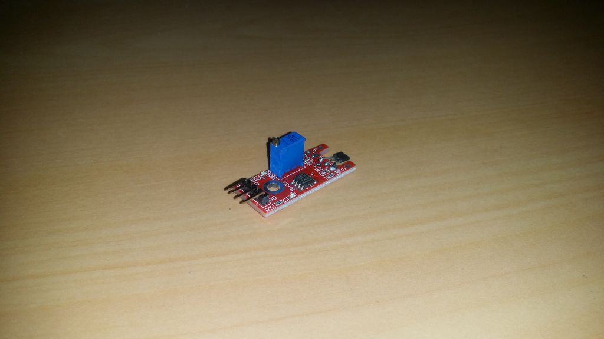

## Sensor Hall Linear

Este sensor produz uma tensão quando colocado em um campo magnético. A tensão pode ser usada para controlar o seu Arduino.

É um sensor analógico, o que significa que pode ler o valor do campo magnético.