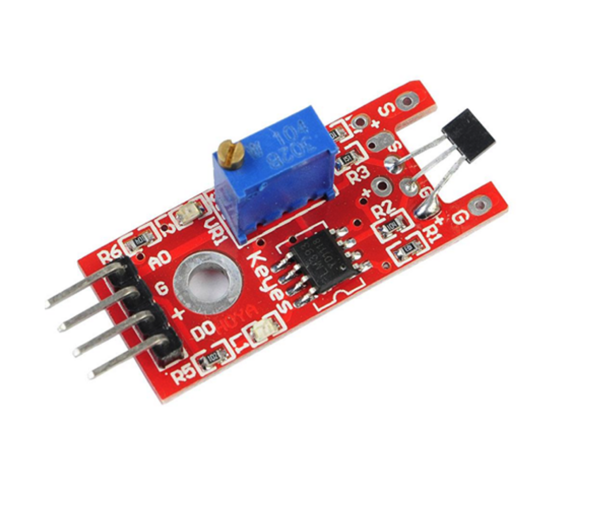

## Sensor Hall Linear

O Sensor Hall de Campo Magnético KY-024 é um módulo eletrônico desenvolvido com a finalidade de detectar a aproximação de um campo magnético. Este sensor pode detectar posições ou velocidade de um motor, por exemplo. Ao detectar um campo magnético, o sensor sofre uma variação em sua saída (analógica ou digital).

– Especificações e características:

– Modelo: KY-024
– Sensor Hall: 49E
– Controlador: LM393
– Tensão de operação: 5VDC
– Saída digital e analógica
– LED indicador para presença de tensão
– LED indicador para saída digital
