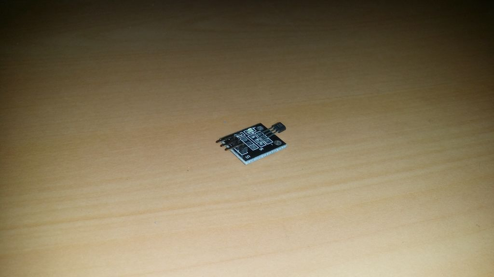

## Sensor Hall Magnético

O sensor Hall magnético é um interruptor magnético. 

Se nenhum campo magnético estiver presente, a linha de sinal do sensor é ALTA. Se um campo magnético é apresentado ao sensor, a linha de sinal fica BAIXA, ao mesmo tempo em que o LED no sensor acende. 

A polaridade do campo magnético influencia a ação de comutação. A parte frontal do sensor precisa da polaridade oposta à da parte traseira do sensor para ligar.
