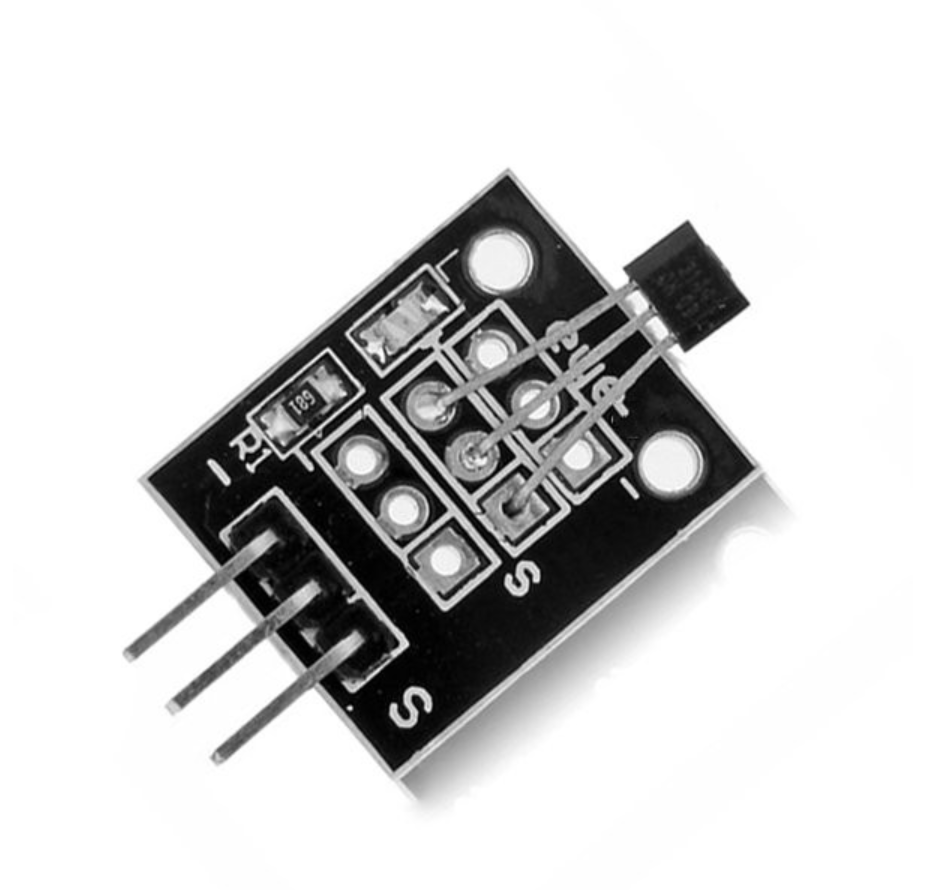

## Sensor Hall Magnético

Funciona como um interruptor usando o princípio de efeito hall, utiliza a tecnologia de fabricação de semicondutores integrados de susceptibilidade magnética do circuito. É pelo regulador de tensão, gerador de tensão hall, contendo um amplificador diferencial, schmidt trigger, circuito de compensação de temperatura e o estágio de saída de coletor aberto composto de circuito sensível sensor magnético, tem seu acionamento de entrada para a intensidade de indução magnética, a saída é um sinal de tensão digital.
