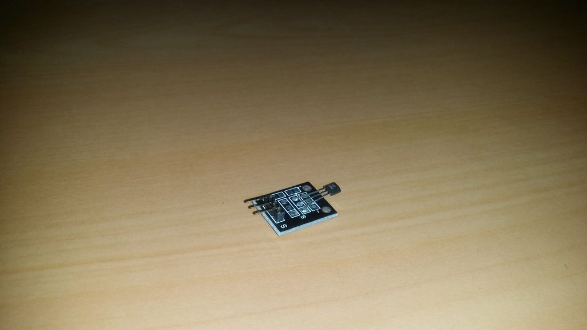

## Sensor Hall Analógico

O sensor analógico hall é um módulo analógico de sensor de campo magnético. A força do campo é dada por uma tensão analógica no pino de sinal do módulo. O sinal de saída é, é claro, um sinal analógico.