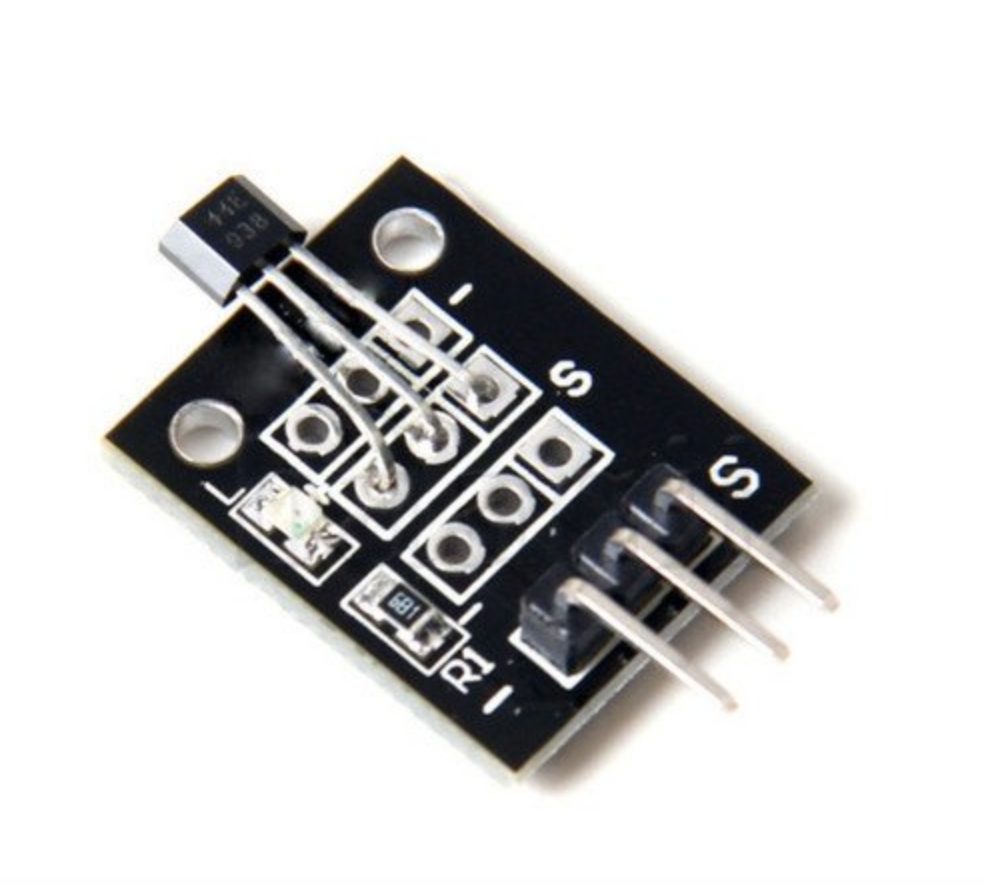

## Sensor Hall Analógico

O sensor analógico hall é um módulo analógico de sensor de campo magnético. A força do campo é dada por uma tensão analógica no pino de sinal do módulo. O sinal de saída é, claro, um sinal analógico.Este sensor KY-003 de alta sensitividade é baseado no efeito Hall para medir os campos magnéticos ao seu redor. Este item pode facilmente converter o sinal magnético em sinal elétrico com alta confiança e sensibilidade, podendo ser usado de forma muito prática com um Arduino.

# Especificações:

- Marca: KEYES
- Modelo: KY-003
- Tensão de Operação: 4,5-24v DC
- Serie: 3144 
