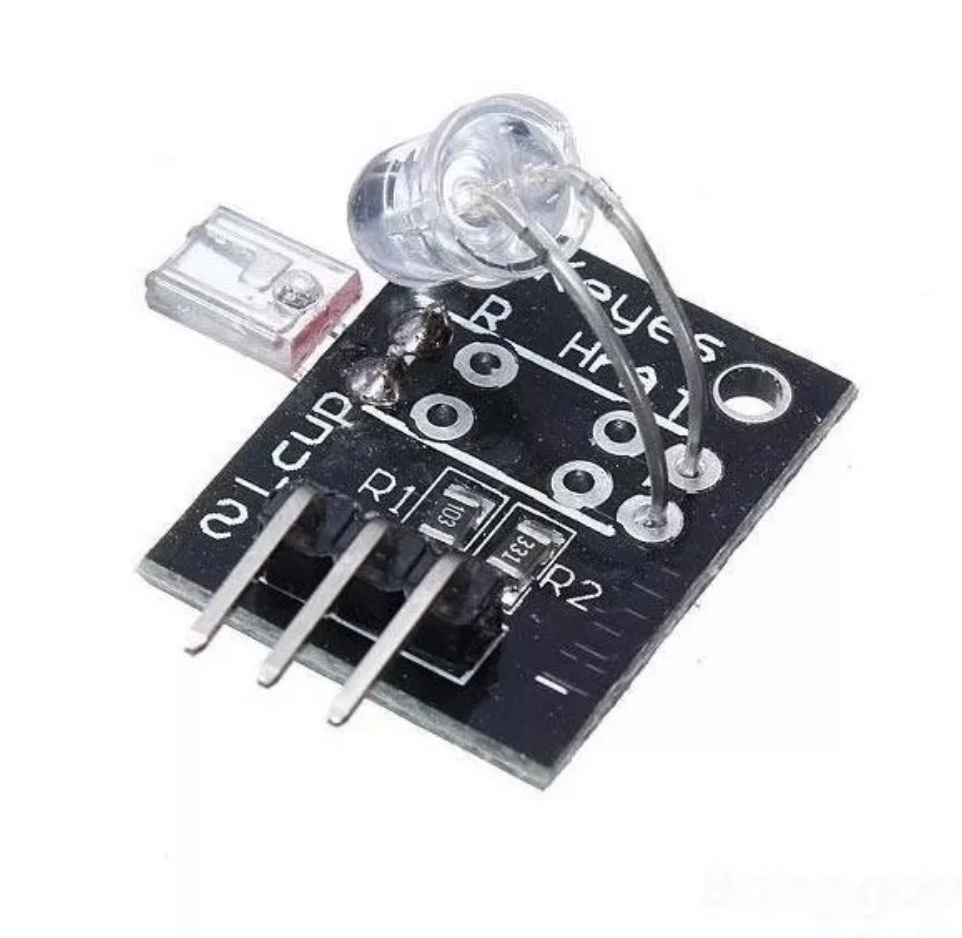

## Sensor de batimentos cardiacos

O "Sensor monitor de pulso batimentos cardíaco infravermelho" é baseado em um emissor e um receptor de infravermelho. Ao colocar o dedo entre os emissor e receptor, é possível monitorar os batimentos cardíacos, pois quando o coração bate, a pressão aumenta, por consequência o volume de sangue também, o que muda a quantidade de luz infravermelha que consegue atravessar o nosso dedo.

É importante tentar não deixar luz artificial (Luz incandescente ou fluorescente) direta sobre o sensor, pois a oscilação (No Brasil 60hz) pode interferir no valor da pulsação medido.

O "Sensor monitor de pulso batimentos cardíaco infravermelho" pode ser usado em projetos de monitoramento de batimentos cardíacos, por exemplo para crianças e idosos, os quais necessitam de uma atenção maior. Com o auxílio de um microcontrolador pode se criar um circuito que acione um alarme caso os batimentos cardíacos alterem acima ou abaixo de uma margem pré-definida.

## Características ##

- Tensão de trabalho: 5V
- Dimensões: 25mm x 22mm x 17mm
- Tipo de sensor: Reflexivo infravermelho (IR)
