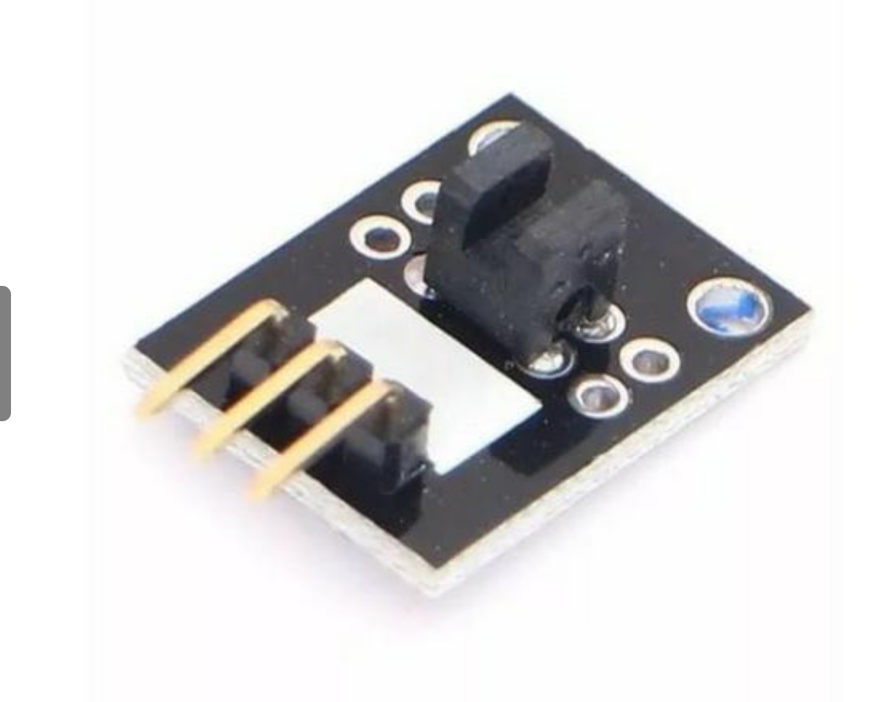

## Sensor de bloqueio de luz

Este módulo funciona como um interruptor de luz em seu projeto. Consiste em um emissor e detector óptico na frente e dois resistores (1 kohm e 33Ohm) na parte traseira. O sensor usa um feixe de luz entre o emissor e o receptor para verificar se a passagem entre um e outro foi bloqueado por algum objeto. Caso esteja bloqueada a passagem, o módulo emite um sinal de nível alto caso contrário, o sinal permanece em nível baixo. Este módulo é semelhante a um Sensor de Barreira utilizadas em esteiras rolantes de supermercados.

Este módulo de simples utilização é adequado para projetos baseados em diversos microcontroladores como Arduino, PIC, Arm, Raspberry Pi e Orange Pi, por exemplo.

## Especificações:
- Tensão de Operação: 3,3-5v DC
- Fácil instalação
- Dimensões Aproximadas: 1,5 x 1,8 x 0,7 cm
- Peso Aproximado: 3 g

## Pinagem:
- S: Sinal
- Pino Central: +VCC
- -: Ground (Terra)
