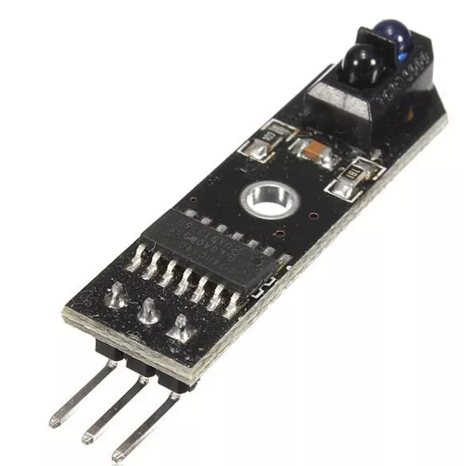

## Sensor de rastreamento

Sensor de rastreio infravermelho da trilha preta. 

# Especificação

- Usa sensor de reflexão infravermelho TCRT5000
- Distância de reflexão de detecção: 1mm 25mm
- Tensão de trabalho: 5V
- Forma de saída: sinal digital (0 e 1)
- Furos de parafuso fixos para fácil instalação
- Uso: amostragem de dados de pulso medidor, aparelho de fax detecção de papel shredder, detecção de obstáculos, detecção de linha em preto e branco
