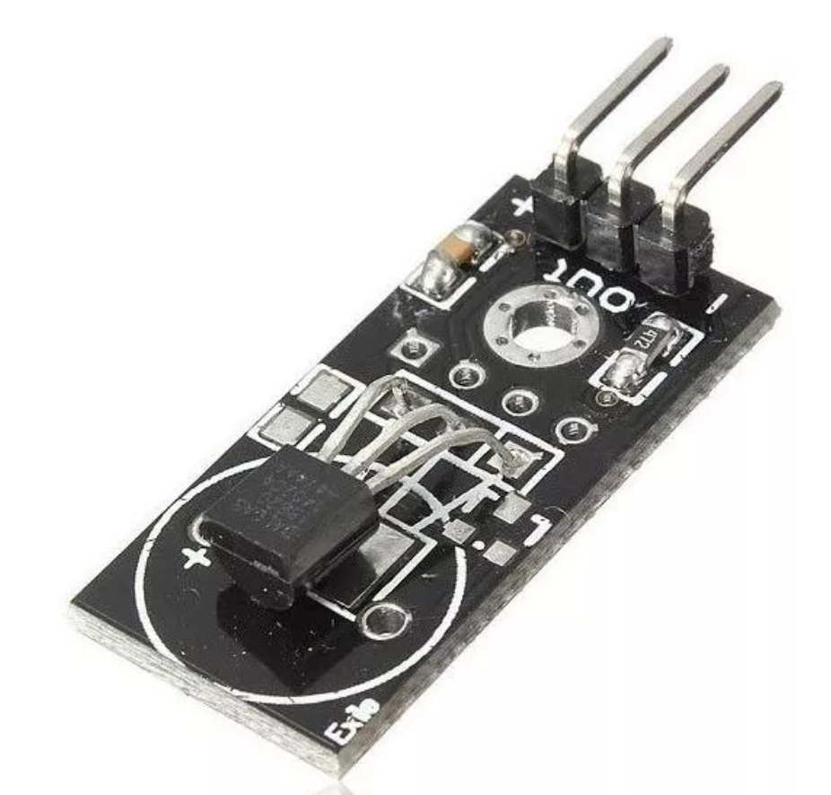

## Sensor de temperatura digital

Ds18b20 Modulo Sensor De Temperatura 5v Digital

Módulo Sensor de Temperatura digital DS18B20, componente eletrônico digital desenvolvido para ser aplicado nos mais diversos ambientes, medindo temparaturas entre -55°C a +125°C. Para que o sensor de temperatura entre em funcionamento é necessário estar conectado junto a uma plataforma de prototipagem, por exemplo, o Arduino, Rapberry Pi, Orange Pi, Nodemcu, Esp8266.

O Sensor de Temperatura DS18B20 possibilita leituras com resolução entre 9 a 12-bit, configurável. Possuir inteface de comunicação simples, unico pino IO, função conhecida como 1-Wire, que permite ligar vários sensores de temperatura em uma única saída digital. Isso é possível por que cada sensor possui um número serial único de 64-bit, permitindo controlar um grandes ambientes, como, por exemplo, o interior de um prédio, uma sala de máquinas, entre outros. Outra característica diferencial do Sensor de Temperatura DS18B20 é que o mesmo pode derivar a alimentação do barreamento de dados, sem precisar de uma fonte externa de energia, essa característica é conhecida como “parasite power”.

 

## Descrição Técnica:

.Faixa de medição de Temperatura: -55°C a +125°C;
.Precisão: 0.5C;
.Taxa de atualização: <750ms;
.Formato de saída de sinal: digital;
.Resolução: 9 ou 12 bits;
.Interface 1 fio (1 OneWire);
.ID único de 64 bits;
.Tensão de Operação: 3 V-5.5 V;
.Dimensões: 28.2mm (comprimento) * 13.1mm (largura) * 5.5mm (altura);
.Peso: 15g.

## Pinagem:

(+): Positivo;
(-): GND ou Negativo;
(Out): Porta IO.
