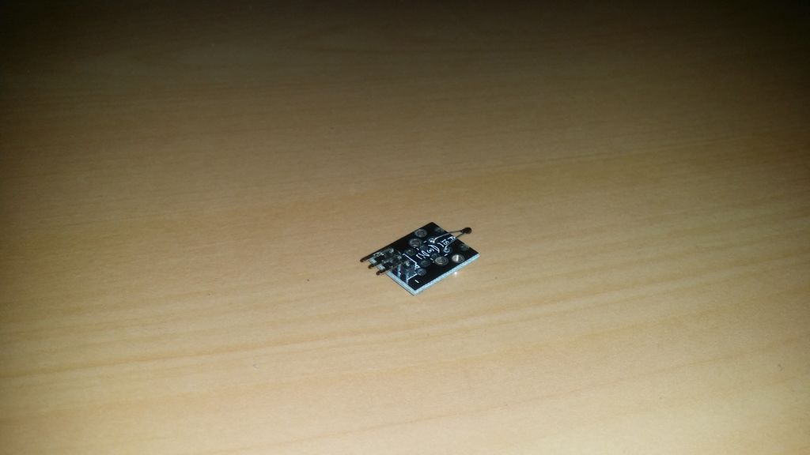

## Sensor de Temperatura Analógico

O sensor de temperatura analógico atua como um resistor variável (NTC / PTC). 

À medida que a temperatura aumenta, o sensor diminui sua saída de tensão. Uma vez que possamos medir a saída de tensão, podemos calibrar o sensor e converter a saída em tensão em temperatura.