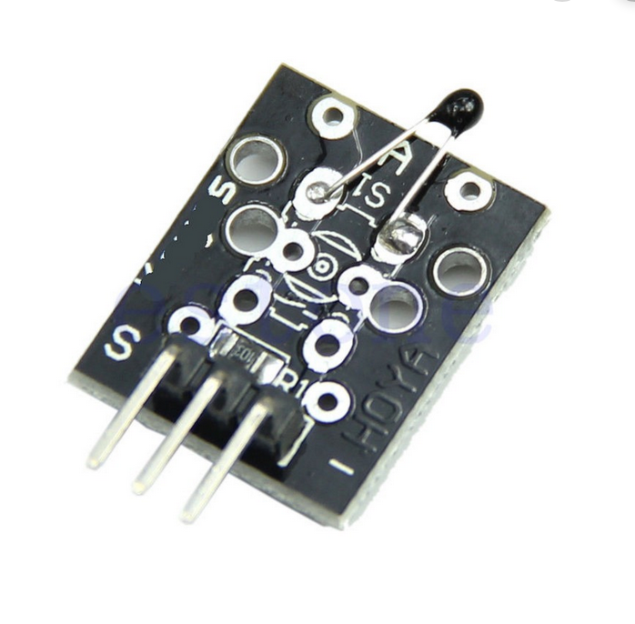

## Sensor de Temperatura Analógico

O sensor de temperatura analógico atua como um resistor variável (NTC / PTC). O ky-013 módulo sensor de temperatura analógico para arduino

## Descrição:

- O sensor de temperatura é um termistor NTC
- Multi-ponto de medição de temperatura mede temperaturas: -55 ° C / + 125 ° C
- Precisão: + / - 0,5 ° C
- Dimensões: 3 x 1,5 x 0,6 centímetros
- Peso: 2g
