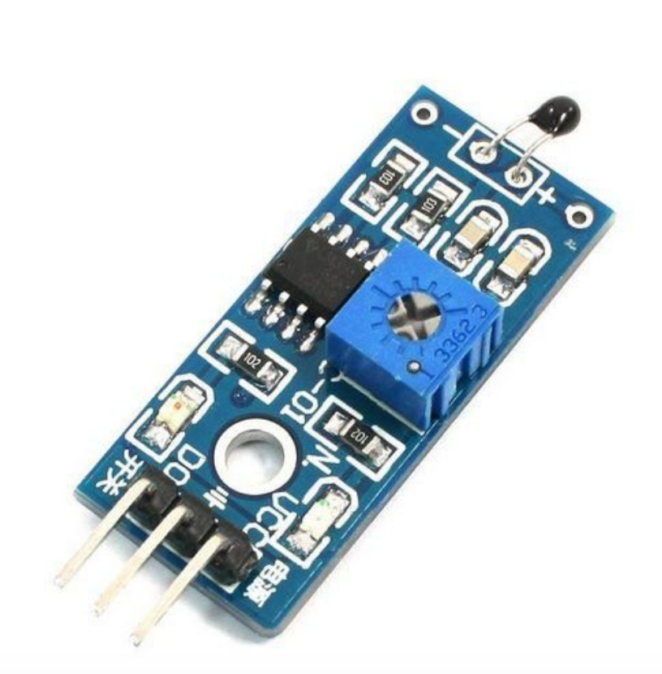

## Sensor de temperatura digital

O Sensor de Temperatura DS18B20 é um componente eletrônico digital desenvolvido para ser aplicado nos mais diversos ambientes, medindo temparaturas entre -55°C a +125°C. Para que o sensor de temperatura entre em funcionamento é necessário estar conectado junto a uma plataforma de prototipagem, por exemplo, o Arduino.
Um diferencial é a sua capacidade de possibilitar leituras com resolução entre 9 a 12-bit, a qual é configurável. Além de possuir uma inteface de comunicação simples por meio de um fio único, função conhecida como 1-Wire, que permite ligar vários sensores de temperatura em uma única saída digital do Arduino.
Só é possível executar a função 1-Wire em razão de que cada sensor possui um número serial único de 64-bit, e isso permite controlar um grande ambiente, como, por exemplo, o interior de um prédio, uma sala de máquinas, entre outros.
Outra característica diferencial do Sensor de Temperatura DS18B20 é que o mesmo pode derivar a alimentação do barreamento de dados, sem precisar de uma fonte externa de energia, essa característica é conhecida como “parasite power”.

## CARACTERÍSTICAS:

- Sensor de Temperatura DS18B20;
- Sensor de temperatura para Arduino;
- Possibilita a utilização de diversos sensores no mesmo pino digital (1-Wire);
- Ideal para medir temperaturas em grandes ambientes;
- Característica “parasite power”;
- Grande precisão;
- Excelente relação custo x benefício;
- Compatível com Arduino, Raspberry Pi, ARM, PIC, etc.;
- Datasheet DS18B20.

## ESPECIFICAÇÕES:

- Modelo: DS18B20;
- Tensão de alimentação: 3.0 - 5.5VDC;
- Leitura de temperatura entre: -55°C a +125°C;
- Pinagem: Ilustrado na imagem a cima;
- Tempo de atualização: <750ms;
- Precisão: ±0.5°C;
- Resolução: 9 ou 12 bits;
- Interface 1 fio (1 Wire);
- ID único de 64 bits;
- Diâmetro: 6mm;
- Peso: <1g.
