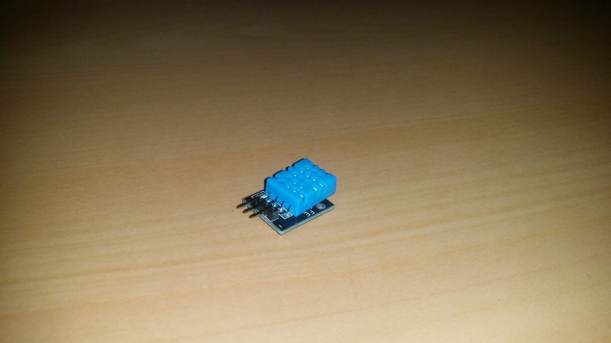

## Sensor de Temperatura e Humidade

Este sensor pode monitorar a temperatura e a umidade. Por ser tão pequeno, não é muito eficaz em áreas maiores, mas funciona bem, por exemplo, em um santuário de répteis.