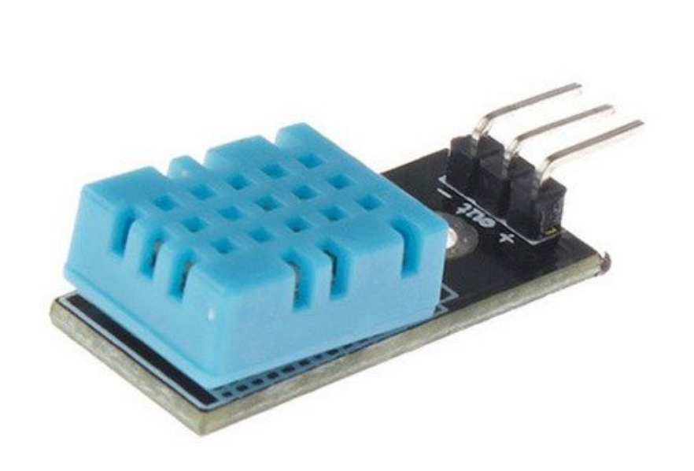

## Sensor de Temperatura e Humidade

E DHT11 é um sensor de temperatura e umidade de saída de sinal digital garantindo alta confiabilidade e estabilidade a longo prazo. O elemento sensor de temperatura é um termistor do tipo NTC e o sensor de Umidade é do tipo HR202, o circuito interno faz a leitura dos sensores e se comunica a um microcontrolador através de um sinal serial de uma via. 

## Características:

- Alimentação: 3,0 a 5,0 VDC (5,5 Vdc máximo)

- Faixa de medição de umidade: 20 a 95% UR

- Faixa de medição de temperatura: 0º a 50ºC

- Precisão de umidade de medição: ± 5,0% UR

- Precisão de medição de temperatura: ± 2.0 ºC
