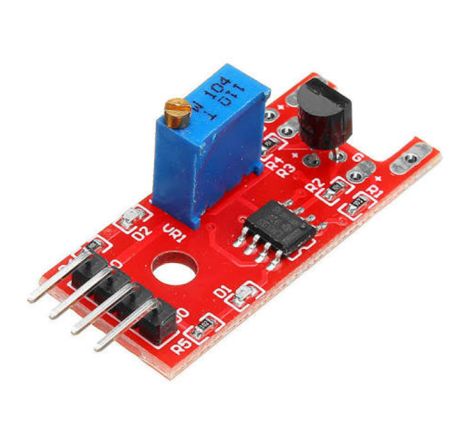

## Sensor de toque

Este sensor fornece um sinal quando um dedo (ou qualquer outra parte do corpo) toca o pino dobrado do transistor.

# Características:
 
- saída de sinal de canal único
- Sinal de saída de baixo nível usado para o alarme do sensor do toque do corpo humano
- Sensibilidade ajustável
- Com furo de parafuso fixo para fácil instalação

# Especificações:

- Tensão de funcionamento: para DC 5V
- Material: PCB + latão
- Dimensões: 43 x 16 x 15 mm
- Peso: 3 g
- Cor: vermelho ou azul
