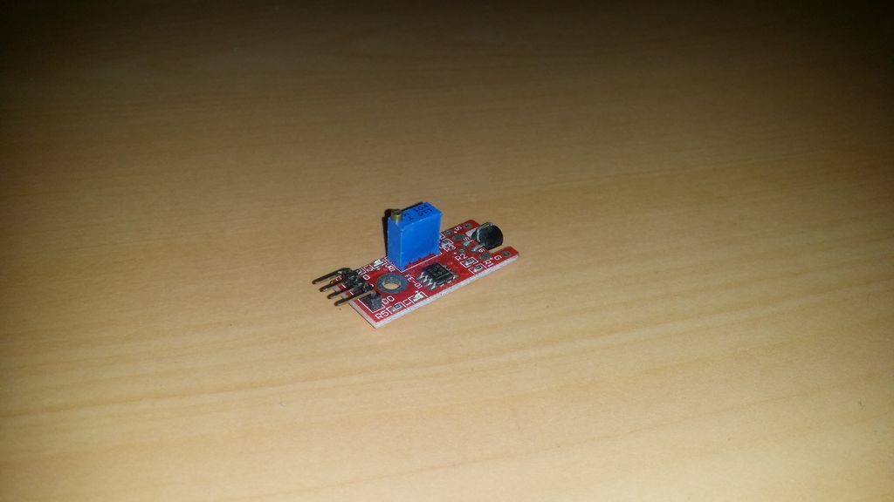

## JoyStick

O JoyStick é um sensor analógico que pode ser usado para controlar o seu arduino.

Os JoySticks analógicos são basicamente potenciômetros, portanto, eles retornam valores que podem ser tornados visíveis usando o código fornecido nesta etapa.

Ao clicar no monitor serial, você verá os valores. Depois de mover o JoyStick, os valores serão alterados. Esse código também é útil se você deseja controlar o seu Arduino usando um JoyStick.