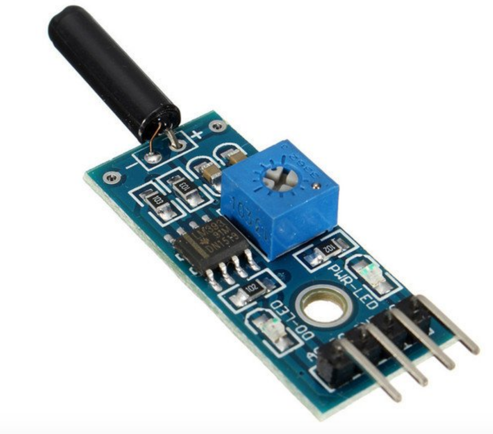

## Sensor de vibração

Este sensor foi feito para detectar vibrações, sendo que quando a intensidade de vibração está abaixo do valor ajustado, a saída do sensor fica em estado alto, e quando a intensidade de vibração ultrapassa a faixa, a saída fica em estado baixo. A saída digital pode ser conectada diretamente a um microcontrolador como Arduino e sua sensibilidade pode ser ainda ajustada através do potenciômetro presente no sensor.

# Especificações:

- Tensão de Operação: 3,3-5v
- Saída Digital
- Comparador LM393
- Fácil instalação
- Led indicador para tensão
- Led indicador para saída digital

# Pinagem:

- VCC: 3,3-5v
- GND: GND
- D0: Saída Digital 
