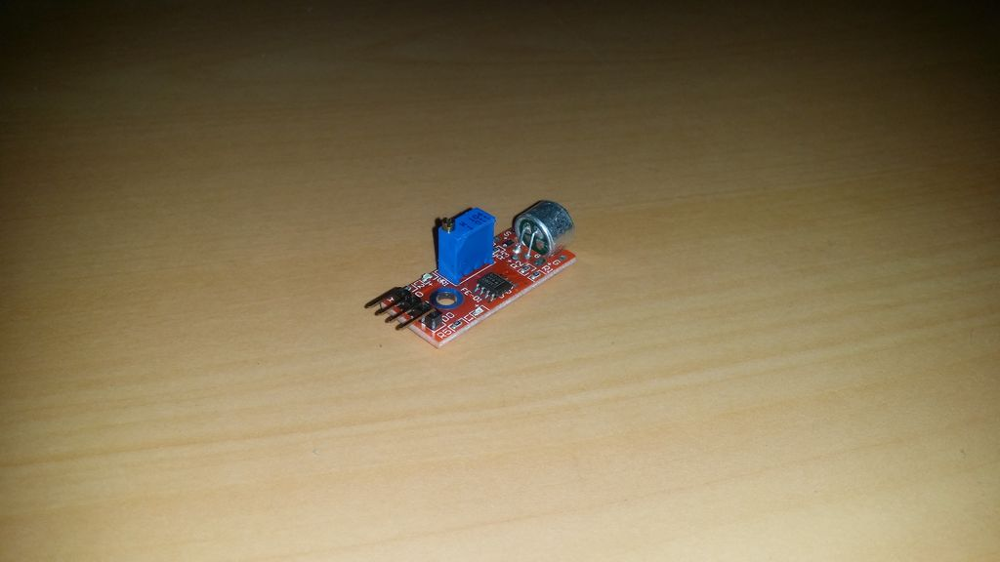

## Sensor grande de som

Este sensor pode detectar som e emitir um sinal analógico e um sinal digital que pode ser usado para, por exemplo, criar um interruptor de luz de bater palmas. 

Este sensor é muito útil com o módulo de relé.