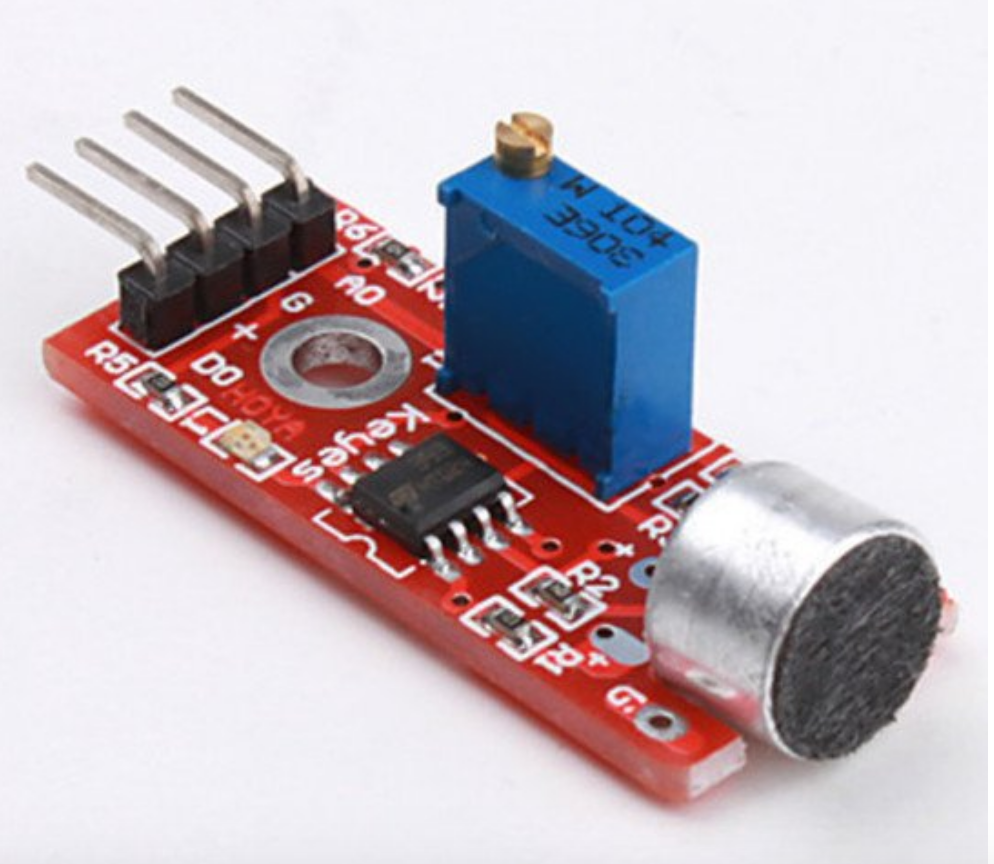

## Sensor de som tamanho grande

O objetivo deste sensor é medir a intensidade sonora do ambiente ao seu redor, variando o estado de sua saída digital caso detectado um sinal sonoro. Possui um microfone de condensador elétrico e pode ser usado em sistemas de alarme por exemplo.

# Especificações:

- Comparador LM393
- Tensão de Operação: 3.3-5V DC
- Sensibilidade ajustável via potenciômetro
- Saída Digital
- Fácil instalação
- Led indicador para saída digital

 # Pinagem:

- GND: Terra
- OUT: Saída Digital
- VCC: Tensão de Entrada 3.3-5Vv
