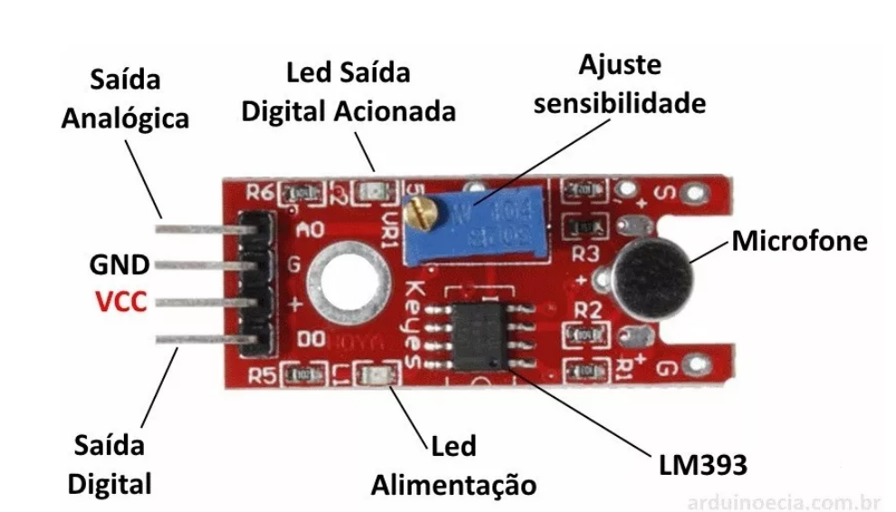

## Sensor de som tamanho pequeno

O objetivo deste sensor de som é medir a intensidade sonora do ambiente ao seu redor, variando o estado de sua saída digital caso detectado um sinal sonoro. Possui um microfone de condensador elétrico e pode ser usado em sistemas de alarme por exemplo.

O limite de detecção pode ser ajustado através do potenciômetro presente no sensor que regulará uma saída digital. Contudo para ter uma resolução melhor é possível utilizar a saída analógica e conectar a um conversor AD, como a presente no Arduino por exemplo.

# Especificações:

– Marca: KEYES
– Modelo: KY-038
– Comparador LM393
– Tensão de Operação: 4-6v DC
– Sensibilidade ajustável via potenciômetro
– Saída Digital e Analógica
– Fácil instalação
– Led indicador para tensão
– Led indicador para saída digital

# Pinagem:

– AO: Saída Analógica
– GND: Terra
– VCC: Tensão de Entrada 3-24v
– DO: Saída Digital
