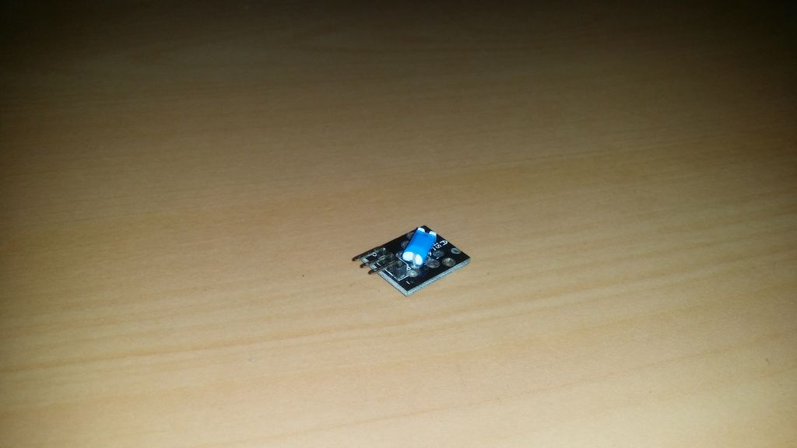

## Tilt Switch

Este sensor contém uma pequena bola de metal que completará um circuito, dependendo da posição no sensor.

Como o sensor é muito básico, ele só pode detectar grandes alterações quando está inclinado e não pode medir o ângulo de sua inclinação.