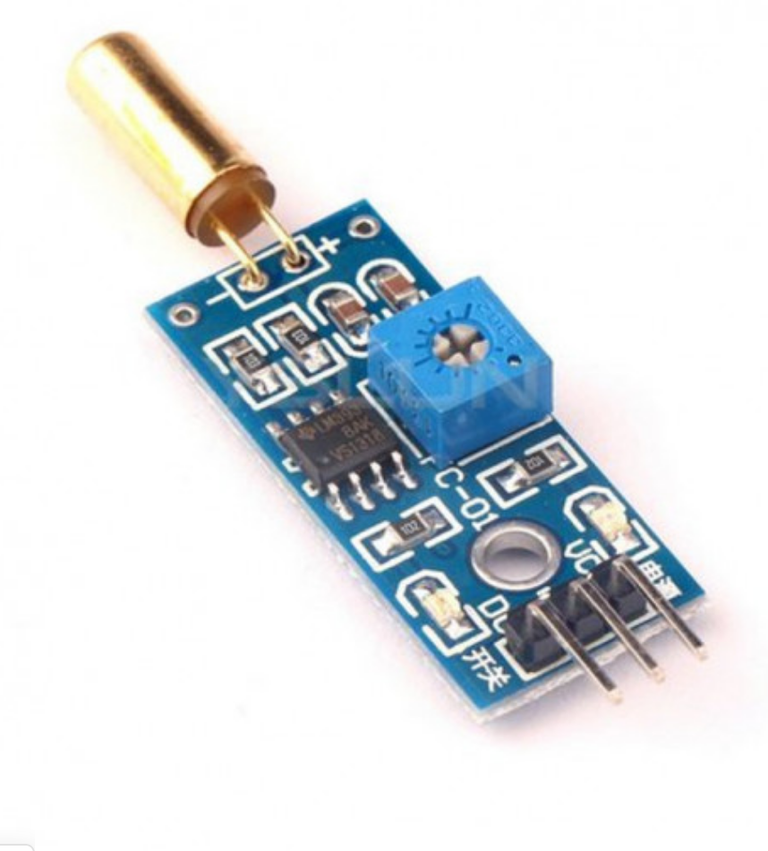

## Tilt Switch

O Módulo Sensor de Inclinação ou Sensor Tilt é capaz de identificar e indicar que determinado objeto se inclinou, em projetos de automação residencial geralmente é aplicado em sistemas antifurto. È um módulo desenvolvido para atuar em conjunto com sistemas microcontroladores, entre eles, Arduino, Raspberry PI, PIC, ARM, etc.

## Dados Técnicos:

- CI principal: LM393;
- Precisão da inclinação: ~15-45°.
- Tensão de operação: 3.3V~5V;
- Possui trimpot para ajustar a sensibilidade;
- LED indicador de funcionamento;
- Interface de saída digital, pode ser conectado diretamente à porta I/O microcontrolador.
